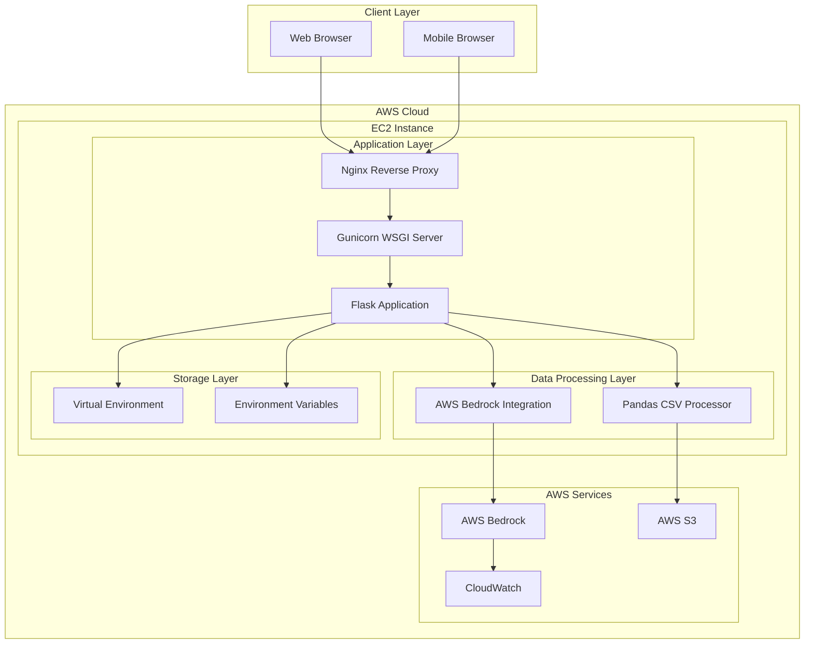
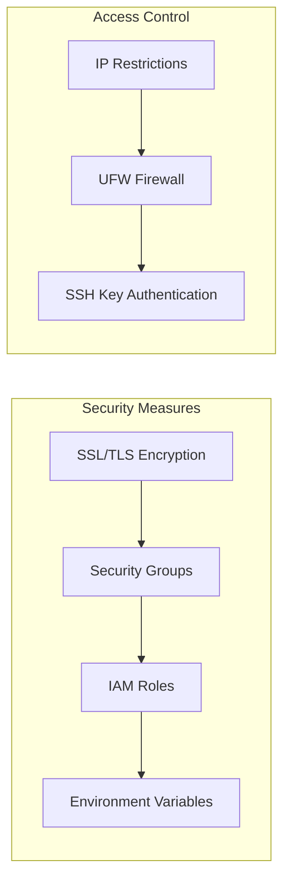
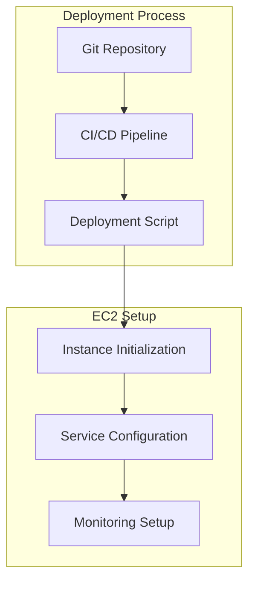
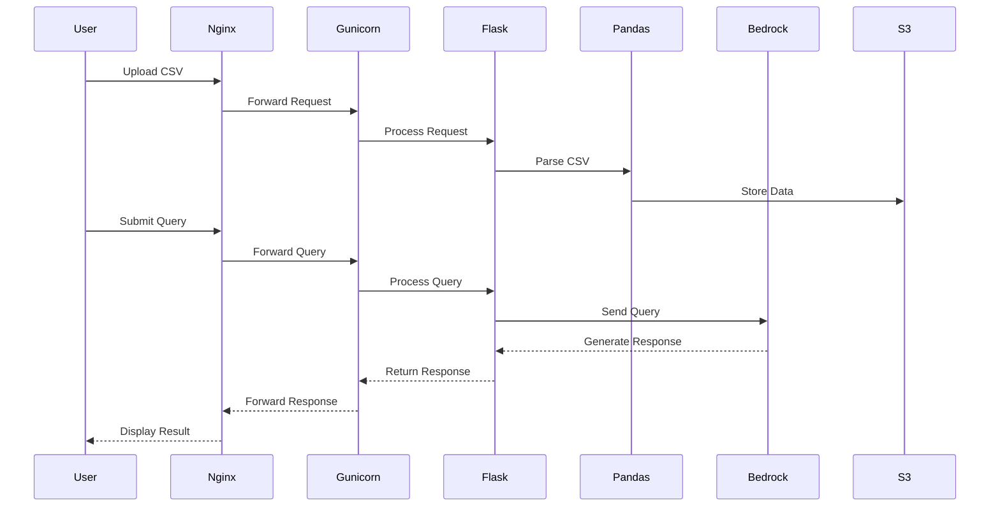

# CSV Scanner Application Architecture

## System Overview

## Component Details

### Client Layer

- **Web Browser**: Standard web interface for desktop users
- **Mobile Browser**: Responsive interface for mobile users

### Application Layer

- **Nginx (Port 80)**:

  - Reverse proxy
  - SSL/TLS termination
  - Static file serving
  - Load balancing

- **Gunicorn (Port 8000)**:

  - WSGI server
  - 4 worker processes
  - Process management
  - Request handling

- **Flask Application**:
  - Web framework
  - Route handling
  - Request processing
  - Response generation

### Data Processing Layer

- **Pandas**:

  - CSV file parsing
  - Data manipulation
  - Status determination
  - Data analysis

- **AWS Bedrock Integration**:
  - Natural language processing
  - Query understanding
  - Response generation
  - AWS API communication

### Storage Layer

- **Virtual Environment**:

  - Python dependencies
  - Isolated runtime
  - Package management

- **Environment Variables**:
  - AWS credentials
  - Configuration settings
  - Security parameters

### AWS Services

- **AWS Bedrock**:

  - AI/ML capabilities
  - Natural language understanding
  - Response generation

- **AWS S3**:

  - File storage
  - Data persistence
  - Backup storage

- **CloudWatch**:
  - Logging
  - Monitoring
  - Metrics collection

## Security Architecture

## Deployment Architecture

## Data Flow

